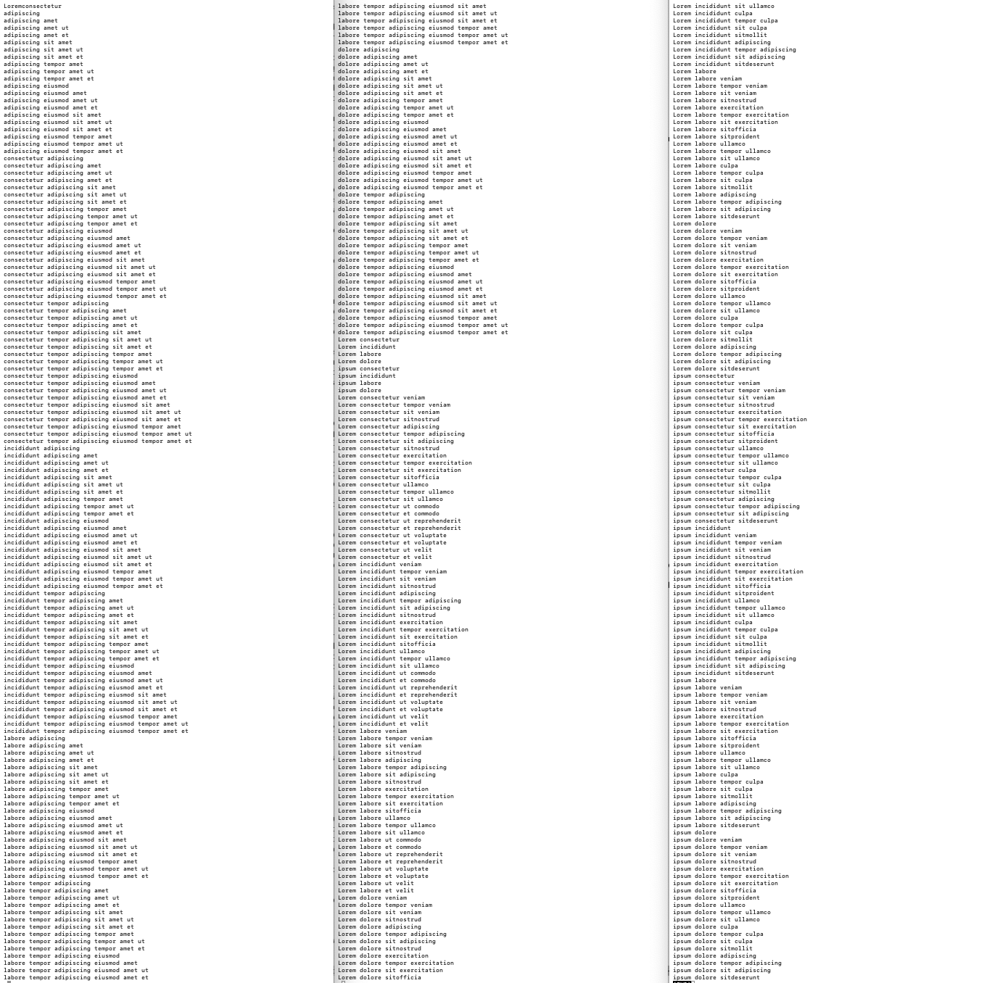
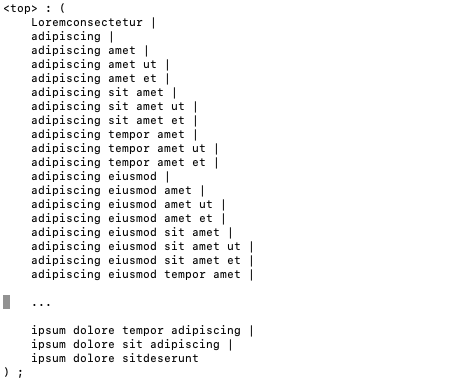
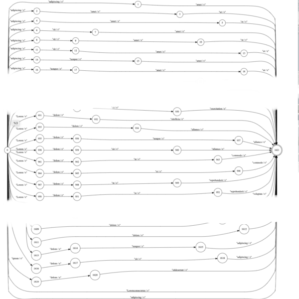
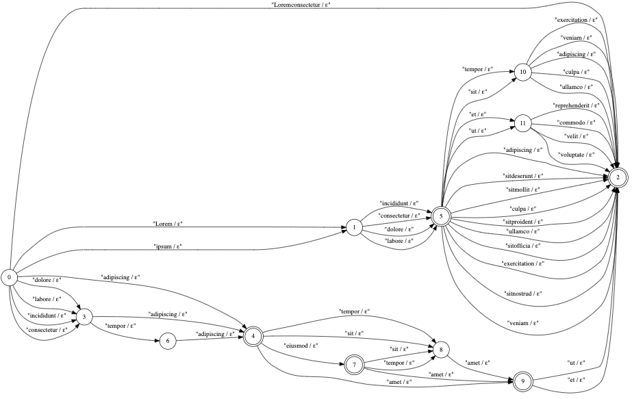
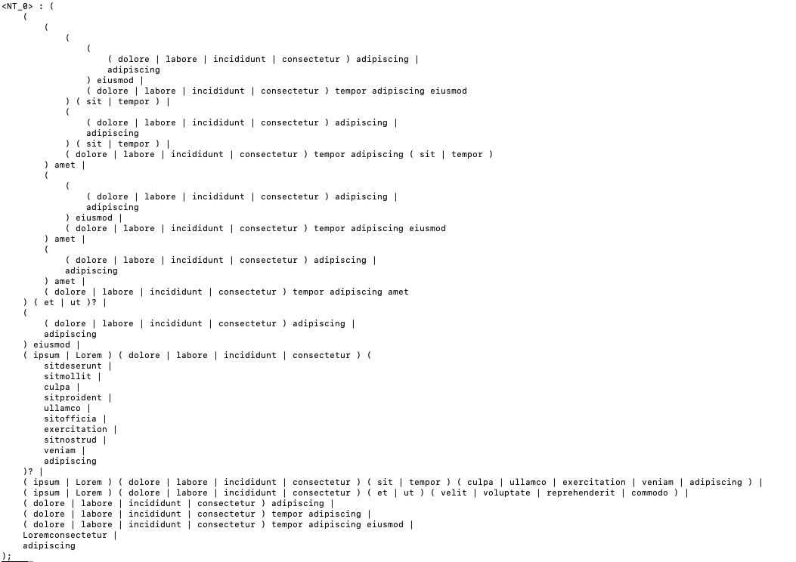
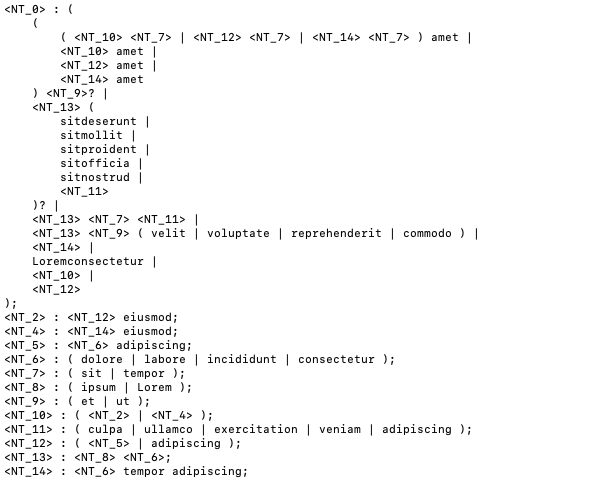
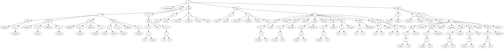

# nlpregex 

Regular Language Representation Converter, Visualizer, and Decoder &amp; Acceptor.


<a href="docs/banner.png"> </a>

# Highlights

* Closed regular language represntation eco-system

* Automatic generation of RE from a flat list

* Common subexpression detection and reduction

* Visualization of AST, NFA, DFA with Grpahviz

* Decoder &amp; acceptor with enhanced regular expression to include output attributes


# Description

Nlpregex is a set of python tools and components to visualize and convert representation
of regular language.
It is aimed at speech recognition and natural language processing, 
and the alphabets (Σ) are not characters, but tokenized terminals.
The conversion of the representations forms a closed ecosystem among the following:

* Regular Expression (RE)

* Abstract Syntax Tree (AST)

* Nondeterministic Finite-state Automaton (NFA) 

* Deterministic Finite-state Automaton (DFA)

* Flat list of phrases (provided the language does not contain infinite repetitions)


The visualization of AST, NFA, and DFA are done by GraphViz.

<a href="docs/ecosystem.png"> </a>

The regular expression is augmented to include the output attributes after a terminal,
and before and after a group enclosed by '(' and ')' in paires.
The attributes are transferred to the output tokens of FA and it is used for the decoder as FST.

# Conversion from FA to AST(s)

<a href="docs/conversion.png"> </a>

The technical contribution of this project is the conversion from FA to AST,
which makes it possible to convert a flat list of phrases to a regular expression.
It takes the following steps.

## 1. Form a set of equations

The first step Forms a set of simultaneous equations in [Kleene Algebra](https://en.wikipedia.org/wiki/Kleene_algebra).
Each state in FA represents a variable, and each input token a coefficient.
Each equation represents the transitions from a single state to its out-neighbors.
One artificial start state and another final state are introduced.
The artificial start state has an epsilon transition to the real start state,
and the real final states have epsilon transitions to the artificial final state.
The coefficients are represented by a special kind of ASTs, called [sseForest](regular_language/sse_forrest.py).

## 2. Solve the equations

The second step solves the equations down to the row that corresponds to the artiicial start state 
by a [solver](regular_language/sse_solver.py).
The row reduction is done by substitution similar to Gaussian elimination.
The self-recursions are eliminated by [Arden's rule](https://en.wikipedia.org/wiki/Arden%27s_rule).
The resultant equation has the following form: 

    ```<artificial_start_state> = coeff <artificial_final_state>```

The remaining coefficient corresponds to the resultant AST.

## 3. Optionally detect and reduce the common subexpressions.
The third step optionally tries to detect and reduce common subexpressions.
It is not only a [common subtree reduction](regular_language/common_subtree_reducer.py)
but it also considers the following two types.

   * Common terms among the union nodes. [(Reducer implementation)](regular_language/common_union_subexpression_reducer.py)
     Ex. `(abc(a|b) |def|ghi?)` and `(abc(a|b)|jkl|ghi?)` has a common subexpression `(abc(a|b)|ghi?)`.

   * Common substrings among the serial nodes.[(Reducer implementation)](regular_language/common_substring_reducer.py)
     Ex. `(a b a b c)` and `(b a b c a)` has a longest common substring `(b a b)`.

Those common subexpressions are detected and reduced one-by-one in a greedy manner with the following criteria.

* Tree height
* Number of terminals under the subtree
* Number of occurrences of the same subtree
* Length of the regular expression

# Conversion from a Flat List to RE

0. Initial input file of a flat list of phrases

<a href="samples/sample_expanded_04.txt"> </a>


1. Parse by Lark LR(1) line parser into a trivial AST.

<a href="samples/flat_list_parsed_rule.txt"> </a>


2. Convert the AST to a trivial lattice NFA 

<a href="samples/flat_list_nfa.svg"> </a>


3. Convert the NFA to DFA by OpenFST (determinization and equivalent states reduction)

<a href="samples/flat_list_dfa.svg"> </a>


4. Conversion from FA to a single AST (see above)

<a href="samples/sample_auto_generated_single_04.txt"> </a>


5. Reduce the AST to a set of ASTs with nonterminals (see above)

<a href="samples/sample_auto_generated_reduced_04.txt"> </a>


# Regular Expression (Rule) Syntax

A regular expression, or rule, consists of two parts: LHS and RHS.
LHS designates the nonterminal for the expression.
RHS is the actual regular expression.
Ex.  `<NT_0> :  a b c ;`


## Unary operators

* 0 or more repetition (kleene closure) (`*`) Ex. `a*`, `(a b c)*`

* 1 or more repetition (`+`) (`*`) Ex. `a*`, `(a b c)*`

* Option (`?`) (`*`) Ex. `a?`, `(a b c)?`

* finite repetition (`{min,max}`) Ex. `a{1,3}`, `(a b c){2,5}`

## Binary operators

* Union (selection) (`|`) Ex. `(a|b|c)`

* Concatenation  Ex. `a b c`

## Alphabets

* Terminal : a word token.  Ex. `abc`

* Nonterminal : a token enclosed by angle brackets `<>` Ex. `<NT_0>`

## Others

* Grouping by `(` and `)` Ex. `a b c ( d | f | g | h i ) j k`

* Output attributes enclosed by `[` and `]`
  Output attributes can be placed immediately after a terminal, or before and after a grouping.
  Ex. `a b[action_01] c`, ` a b c [prologue_01](d | e | f [action_f] )[epilogue_01] g h i`.


Please see [grammar_nlpregex_rules](regular_language/lark_parser.py) for details.

# Examples

## From a regular expression to pretty-format, flat list, AST, NFA, and DFA
This example takes the sample files [sample_input_04.txt](samples/sample_input_04.txt)
and [sample_input_04_oneline.txt](samples/sample_input_04_oneline.txt)
and visualize the regular expression designated by `<top_rule>`.

### Command to pretty-format.
```shellscript
python re_formatter.py samples/sample_input_04_oneline.txt pretty.txt
```
The output file is the same as [sample_input_04.txt](samples/sample_input_04.txt).

### Command to generate flat list of phrases.
```shellscript
python re_phrase_expander.py samples/sample_input_04_oneline.txt -rule "<top_rule>" expanded.txt
```
The output file is the same as [sample_expanded_04.txt](samples/sample_expanded_04.txt).
Please note that the regular expression in sample_input_04.txt and sample_input_04_oneline.txt has 
redundancies and the output file has duplications, which can be removed by `sort | uniq`.

### Command to generate AST, NFA, and DFA.
```shellscript
`python re_visualizer.py samples/sample_input_04.txt -rule "<top_rule>" -expand_all_nt -ast ast_fig -nfa nfa_fig -dfa dfa_fig -t svg`
```

Here are the outputs generated by the command. (Click the figures to see the SVG file.)

<a href="docs/ast_fig.svg"> </a>

<a href="docs/nfa_fig.svg"> </a>

<a href="docs/dfa_fig.svg"> </a>

## Auto-generate rules from a flat list
This example takes the following [the sample file](samples/sample_expanded_04.txt) that contains a flat list and generate a regular expression 
or a set of regular expressions.

<a href="samples/sample_expanded_04.txt"> </a>


### Command to generate a single regular expression.
```shellscript
python flat_list_to_re.py samples/sample_expanded_04.txt auto_gen_single.txt
```
The output file is the same as [sample_auto_generated_single_04.txt](samples/sample_auto_generated_single_04.txt).

<a href="samples/sample_auto_generated_single_04.txt"> </a>

### Command to generate a set of regular expressions by reducing the common subexpressions.
```shellscript
python flat_list_to_re.py samples/sample_expanded_04.txt auto_gen_reduced.txt -reduce
```
The output file is the same as [sample_auto_generated_reduced_04.txt](samples/sample_auto_generated_reduced_04.txt).
This is the outcome of the most aggressive reduction where any subexpression that has at least two terminals, 
and that occurrs at least twice in the trees are subject to reduction.

<a href="samples/sample_auto_generated_reduced_04.txt"> </a>

## Decode as FST
The following shows an interactive decoding action for the rules 
defined in [sample_input_03.txt](samples/sample_input_03.txt).

```shellscript
$ cat nlpregex\samples\sample_input_03.txt
<nt01> : [out_token1 ]( t01 | t02 | <nt02> )[out_token2] ;
<nt02> : abc def ( [out_token3] (ghi xyz) [out_token4] ) ? ;
$ python3 nlpregex\re_decoder.py -rulefile nlpregex\samples\sample_input_03.txt -rule "<nt01>" -expand_all_nt
t01                   # <= Input by the user
out_token1 out_token2 # <= Output by the decoder
abc def               # <= Input by the user
out_token1 out_token2 # <= Output by the decoder
t03                   # <= Input by the user
__NOT_ACCEPTED__      # <= Output by the decoder
abc def ghi xyz       # <= Input by the user
out_token1 out_token3 out_token4 out_token2 # <= Output by the decoder
$
```

# Install

1. Install [GraphViz](https://www.graphviz.org/).

2. Install [OpenFST](http://www.openfst.org/twiki/bin/view/FST/WebHome).
If you are using Windows, then these guys [here](https://github.com/kkm000/openfst) have a nice ported version.

3. Add the paths to GraphViz & OpenFST command tool to PATH.

4. Install Python3. (Probably you already have [Anaconda](https://www.anaconda.com/) if you are working on NLU stuff.)

5. Install GraphViz binding (`pip install graphviz`)

6. Install [Lark parser](`https://github.com/lark-parser/lark`) (`pip install lark-parser`)

7. Add the path to the directory that contains nlpregex to PYTHONPATH

# Command Line Tools

* [re_formatter.py](nlpregex/re_formatter.py)
This reformats the rules(expressions) in the given file with nice indentation.
```
usage: re_formatter.py [-h]
                       [-rules [<list of nonterminals> [<list of nonterminals> ...]]]
                       [-expand [<list of nonterminals> [<list of nonterminals> ...]]]
                       [-expand_all_nt] [-expand_finite_repeat]
                       [-width_hint [WIDTH_HINT]] [-indent [INDENT]]
                       [infile] [outfile]

reformat regular expression with the specified nonterminals replaced with sub-
expressions

positional arguments:
  infile                input file
  outfile               output file

optional arguments:
  -h, --help            show this help message and exit
  -rules [<list of nonterminals> [<list of nonterminals> ...]]
                        rules to reformat (default ALL)
  -expand [<list of nonterminals> [<list of nonterminals> ...]]
                        tries to expand the given nontermals (default NONE)
  -expand_all_nt        tries to expand all the nonterminals for the specified
                        rule
  -expand_finite_repeat
                        expands finite repeats
  -width_hint [WIDTH_HINT]
                        max width at which this tool tries to fold the
                        selection expression into multiple lines
  -indent [INDENT]      number of spaces for a single indentation
```

* [re_phrase_expander.py](nlpregex/re_phrase_expander.py) 
This expands the specified rule into a list of phrases it accepts.
The finite repetisions are not expanded for an obvious reason.
```
usage: re_phrase_expander.py [-h] [-rule <nonterminal>]
                             [-expand [<list of nonterminals> [<list of nonterminals> ...]]]
                             [-expand_all_nt] [-expand_finite_repeat]
                             [infile] [outfile]

expand phrases of regular expression

positional arguments:
  infile                input file
  outfile               output file

optional arguments:
  -h, --help            show this help message and exit
  -rule <nonterminal>   rule to expand
  -expand [<list of nonterminals> [<list of nonterminals> ...]]
                        tries to expand the given nontermals (default NONE)
  -expand_all_nt        tries to expand all the nonterminals for the specified
                        rule
  -expand_finite_repeat
                        expands finite repeats, otherwise, it will be replaced
                        with a temporary token
```

* [re_phrase_visualizer.py](nlpregex/re_visuzlizer.py) 
This visualizes the specified rule into AST, NFA, and DFA in either SVG or PDF format.
These visuals are created by GraphViz's dot command.
```
usage: re_visualizer.py [-h] [-rule <nonterminal>]
                        [-expand [<list of nonterminals> [<list of nonterminals> ...]]]
                        [-expand_all_nt] [-ast <file name w/o ext>]
                        [-nfa <file name w/o ext>] [-dfa <file name w/o ext>]
                        [-t [pdf/svg]] [-s] [-horizontal]
                        [infile] [outfile]

visualize regular expression in AST, NFA, and DFA

positional arguments:
  infile                input file
  outfile               output file

optional arguments:
  -h, --help            show this help message and exit
  -rule <nonterminal>   rule to expand
  -expand [<list of nonterminals> [<list of nonterminals> ...]]
                        tries to expand the given nontermals (default NONE)
  -expand_all_nt        tries to expand all the nonterminals for the specified
                        rule
  -ast <file name w/o ext>
                        draws abstract syntax tree to the file
  -nfa <file name w/o ext>
                        draws NFA to the file.
  -dfa <file name w/o ext>
                        draws DFA to the file.
  -t [pdf/svg]          visual output file type. svg or pdf. default: pdf. Use
                        svg if you have a unicode issue on Windows.
  -s                    tries to show the visual immediately
  -horizontal           draw AST horizontally
```

* [re_decoder.py](nlpregex/re_decoder.py) 
This decodes the input tokens with the specified rule into output tokens.
It works as a finite-state transducer, whose rules are specified by an augmented regular expression.
```
usage: re_decoder.py [-h] [-rulefile RULEFILE] [-rule <nonterminal>]
                     [-expand [<list of nonterminals> [<list of nonterminals> ...]]]
                     [-expand_all_nt]
                     [infile] [outfile]

decode regular language with output attributes

positional arguments:
  infile                input file
  outfile               output file

optional arguments:
  -h, --help            show this help message and exit
  -rulefile RULEFILE    regular expression rule file
  -rule <nonterminal>   rule to expand
  -expand [<list of nonterminals> [<list of nonterminals> ...]]
                        tries to expand the given nontermals (default NONE)
  -expand_all_nt        tries to expand all the nonterminals for the specified
```


* [flat_list_to_re.py](nlpregex/flat_list_to_re.py) 
This generates a rule or a set of rules from the given flat list of phrases.
It also detects and reduces the common subexpressions.
```
usage: flat_list_to_re.py [-h] [-reduce]
                          [-min_num_occurrences [MIN_NUM_OCCURRENCES]]
                          [-min_num_terms [MIN_NUM_TERMS]]
                          [-width_hint [WIDTH_HINT]] [-indent [INDENT]]
                          [infile] [outfile]

generate regular expression from a flat list


positional arguments:
  infile                input file
  outfile               output file

optional arguments:
  -h, --help            show this help message and exit
  -reduce               tries to reduce the common subexpressions
  -min_num_occurrences [MIN_NUM_OCCURRENCES]
                        min number of occurrences of a common subexpression to
                        be considered for reduction
  -min_num_terms [MIN_NUM_TERMS]
                        min number of terminals in a common subexpression to
                        be considered for reduction
  -width_hint [WIDTH_HINT]
                        max width at which this tool tries to fold the
                        selection expression into multiple lines
  -indent [INDENT]      number of spaces for a single indentation
```


# Limitation
If a regular expression has paired output attributes associated with a group, then the reconstruction
from the corresponding DFA back to an AST is not possible due to the lost associativity during
the conversion from NFA to DFA.
Therefore, if a regular expression has paired output attributes associated to a group, 
then the reconstruction from the corresponding flat list back to an AST is not possible.
However, the converted DFA with lost associativity still works correctly as a decoder.

# TODO

* Study the possibility of augmenting the expression and the tools to integrate statistical treatment in order for the decoder to work as WFST.


# Dependencies

* [OpenFST](http://www.openfst.org) under Apache License

* [GraphViz](https://www.graphviz.org) under Common Public License Version 1.0

* [Lark-Parser](https://github.com/lark-parser/lark) under MIT License


# Contact

For technical and commercial inquiries, please contact: Shoichiro Yamanishi

yamanishi72@gmail.com