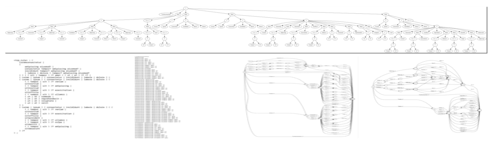
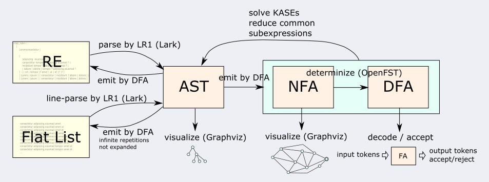
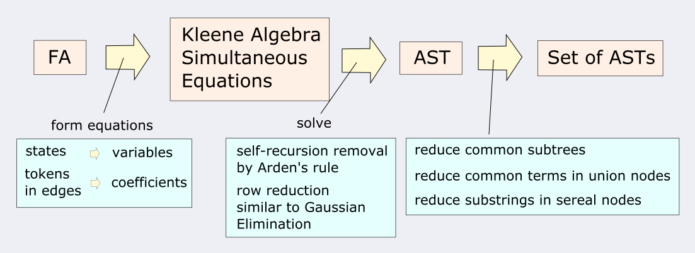
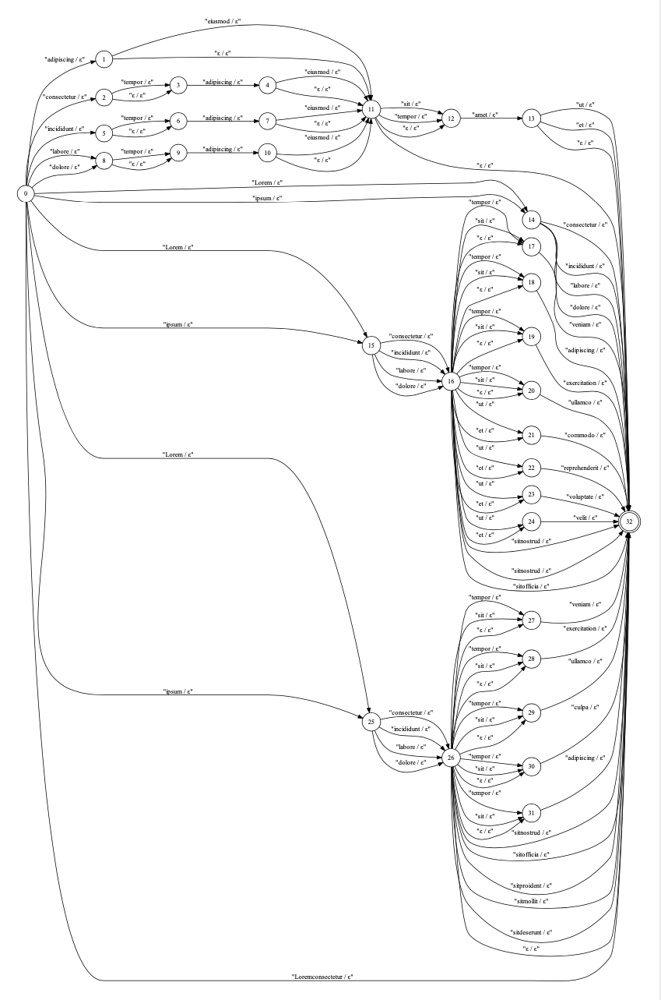
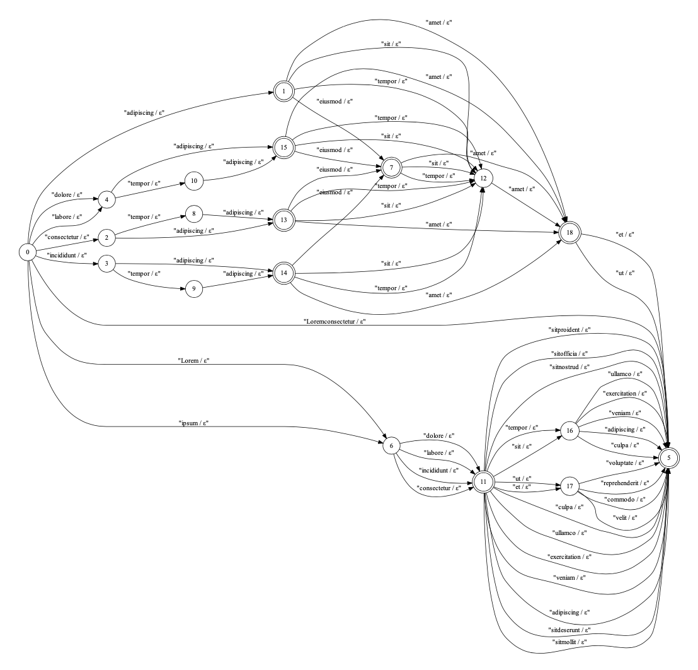

# nlpregex READEME UNDER DEVELOPMENT SOON TO BE READY
Regular Language Representation Converter, Visualizer, and Decoder &amp; Acceptor

# Description
Nlpregex is a set of python tools and components to visualize and convert representation of regular language.
It is aimed at speech recognition and natural language processing, 
and the alphabets (Σ) are not characters, but tokenized terminals.
The conversion of the representations forms a closed ecosystem among the following

* Regular Expression (RE)
* Abstract Syntax Tree (AST)
* Nondeterministic Finite-state Automaton (NFA) 
* Deterministic Finite-state Automaton (DFA)
* Flat list of phrases (provided the language does not contain infinite repetitions.)

The regular expression is augumented to include the output attributes after a terminal, and
before and after a group enclosed by '(' and ')' in paires.
The attributes are transferred to the output tokens of FA and it is used for the decoder as FST.

# Conversion from FA to AST
The technical contribution of this project is the conversion from FA to AST, which makes it possible
to convert a flat list of phrases to a regular expression.
The visualization of AST, NFA, and DFA are done by GraphViz.

# Examples

## From regular expression to pretty-format, flat list, AST, NFA, and DFA

## Auto generate rules from a flat list

## Decode as FST

# Install

1. Install GraphViz
2. Install OpenFST
3. Add GraphViz & OpenFST command tools paths to PATH
4. Install Python3
5. Install GraphViz binding (pip install GraphViz)
6. Install Lark parser (pip install lark-parser)
7. Add the path that contains nlpregex to PYTHONPATH

# Dependencies

* [OpenFST](http://www.openfst.org) under Apache License

* [GraphViz](https://www.graphviz.org) under Common Public License Version 1.0

* [Lark-Parser](https://github.com/lark-parser/lark) under MIT License

# Contact

For technical and commercial inquiries, please contact: Shoichiro Yamanishi

yamanishi72@gmail.com